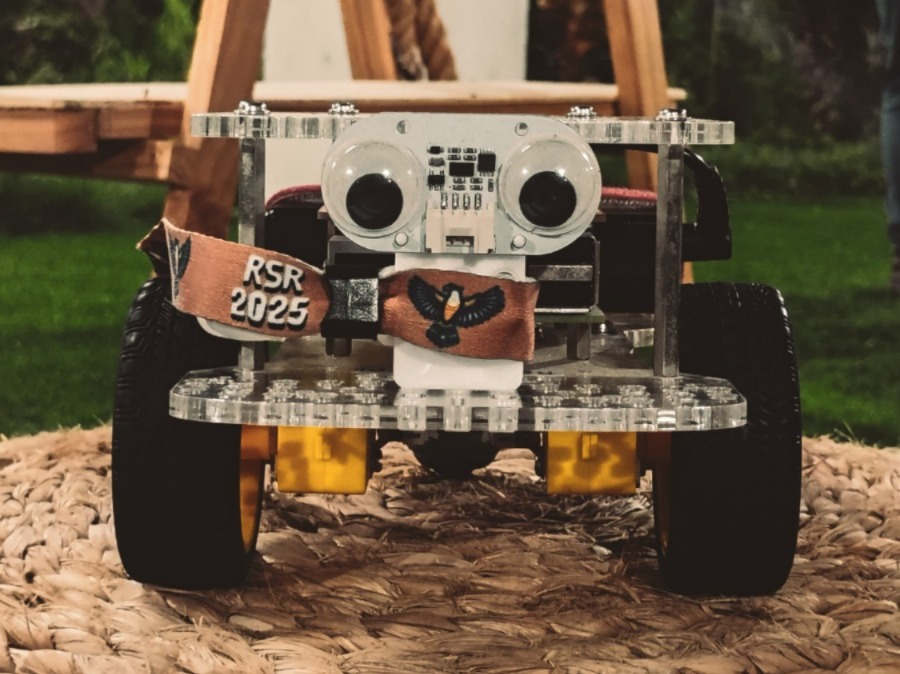

# GoRASGo

The GoRASGo project is an IEEE RAS UFCG initiative to revitalize the GoPiGo3, a board that turns your Raspberry Pi into a fully operating robot. The GoPiGo3 is a mobile robotic platform first developed by Dexter Industries, and acquired by [Modular Robotics](https://modrobotics.com). See [GoPiGo.io](https://GoPiGo.io).



This fork is being developed in order to make the plaftorm software compatible with more recent Debian distributions, updated Python versions and newer Raspberry Pi models using the same GoPiGo3 board and firmware. This repo also includes projects and development pipelines for the physical robot at eROBÓTICA Lab.

# Debian Bookworm Installation

You can install the GoPiGo3 on your own operating system with the following commands in the command line:

1. Clone this repository onto the Raspberry Pi home directory:

```bash
git clone http://www.github.com/DexterInd/GoPiGo3.git /home/pi/Dexter/GoPiGo3
```

2. Run the install script:
```bash
bash $HOME/GoRASGo/Install/install.sh
```

3. The installation will automatically enable interfaces, set up the Python environment and configure the terminal setup script. 

4. For changes to take place, run:
```bash
sudo reboot
```

5. For remote access to your system, SSH into the Pi:
```bash
ssh <username>@<hostname>
```


# License

Please review the [LICENSE.md] file for license information.

[LICENSE.md]: ./LICENSE.md

# See Also

- [IEEE RAS UFCG](https://edu.ieee.org/br-ufcgras/)
- [Modular Robotics](https://modrobotics.com)
- [GoPiGo.io](https://gopigo.io)

---